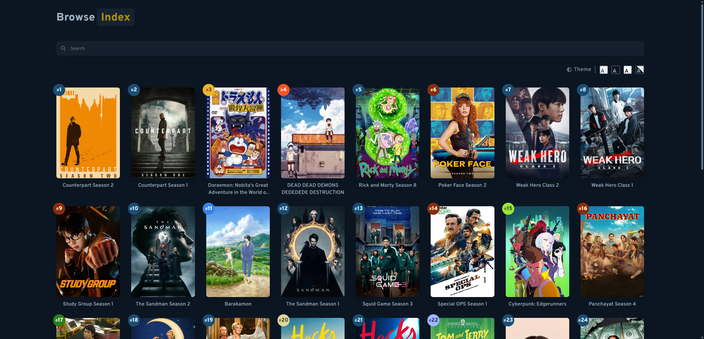
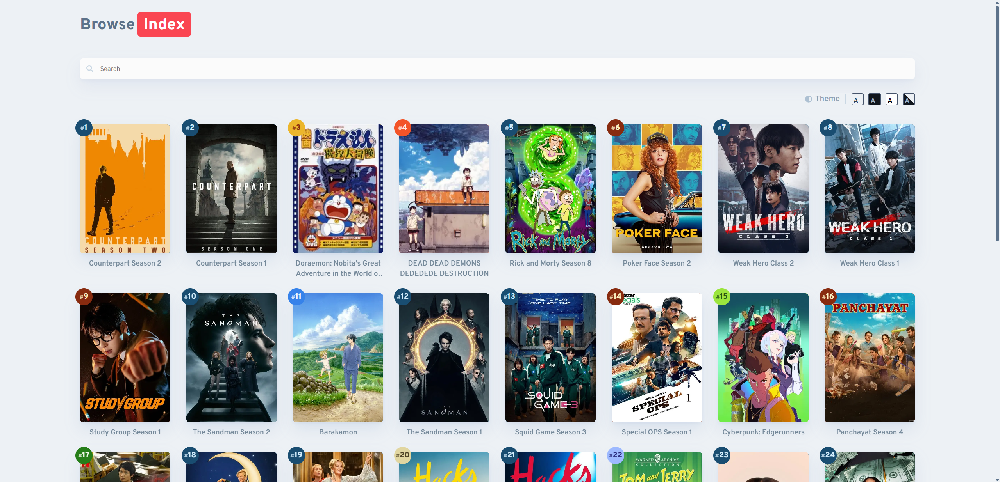
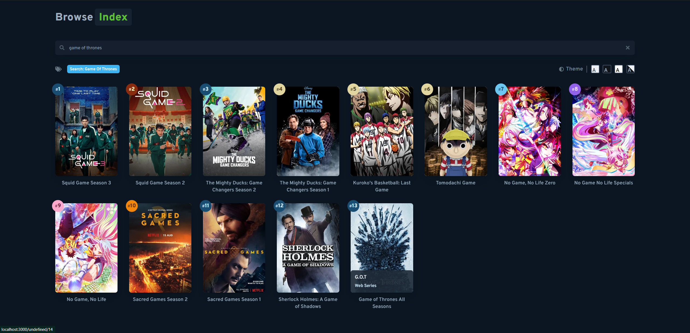

# The Media Index

The Media Index is a modern web application for browsing and searching media items. Built with Next.js, TanStack Query, and MongoDB, it provides a fast, type-safe, and accessible experience.

## Tech Stack

- **Next.js** (React framework)
- **TanStack Query** (data fetching and caching)
- **MongoDB** (database)
- **Biome** (code formatting and linting)

## Screenshots

Below are some screenshots of The Media Index app:

<div align="center">
 
 <br/>
 
 <br/>
 
</div>

## Getting Started

### 1. Clone the repository

```bash
git clone https://github.com/BioHazard786/The-Media-Index.git
cd the-media-index
```

### 2. Install dependencies

```bash
npm install
# or
yarn install
# or
bun install
```

### 3. Environment Setup

Create a `.env.local` file in the root directory with the following variables:

```env
MONGODB_URI=mongodb+srv://<username>:<password>@<cluster-url>/<database>?retryWrites=true&w=majority
CHANNEL_LINK=https://t.me/<your-telegram-channel>
```

### 4. Run the development server

```bash
npm run dev
# or
yarn dev
# or
bun run dev
```

Open [http://localhost:3000](http://localhost:3000) in your browser.

## MongoDB Collection Schema

The main collection is called `INDEX`. Example schema:

```typescript
{
 _id: number;
 name: string;
 alt_name: string;
 anilist_id: string;
 tmdb_movie_id: string;
 image_link: string;
 tmdb_series_id: string;
 tmdb_season: string;
 average_color: string;
 background_color: string;
 text_color: string;
 type: string;
}
```

## Project Structure

- `src/app/` - Next.js app directory
- `src/components/` - UI components
- `src/hooks/` - Custom React hooks
- `src/lib/` - Utility functions and database connection
- `src/model/` - TypeScript models
- `src/server/` - Server actions and API logic

## Code Quality

This project uses [Biome](https://biomejs.dev/) for formatting and linting. To check and fix code:

```bash
bunx ultracite lint
bunx ultracite format
```

## Deployment

Deploy easily on [Vercel](https://vercel.com/) or any platform supporting Next.js.

## License

This project is licensed under the MIT License - see the [LICENSE](LICENSE) file for details.

## Contact

Mohd Zaid - [Telegram](https://t.me/LuLu786) - <bzatch70@gmail.com>

Project Link: [https://github.com/BioHazard786/The-Media-Index](https://github.com/BioHazard786/The-Media-Index)
